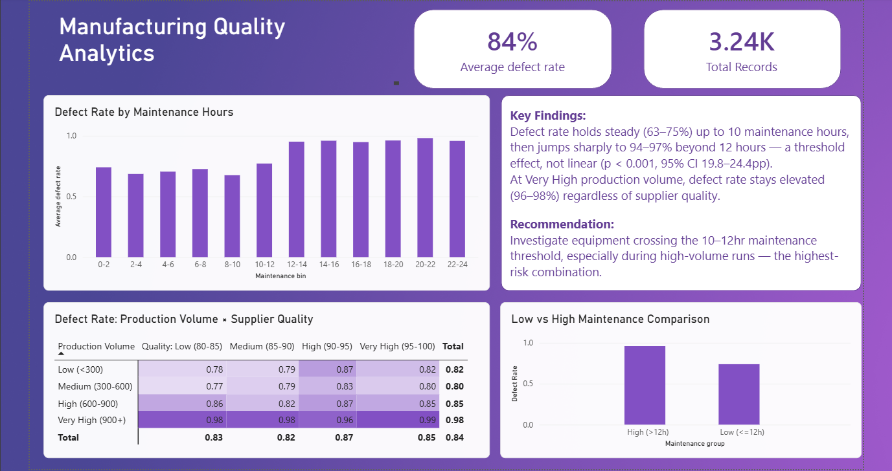
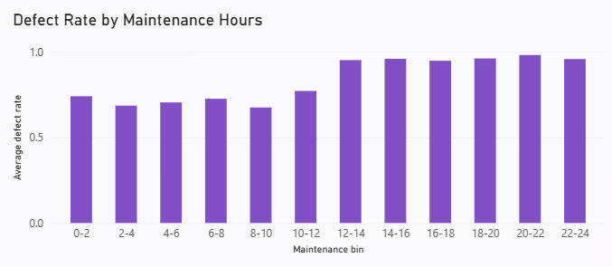
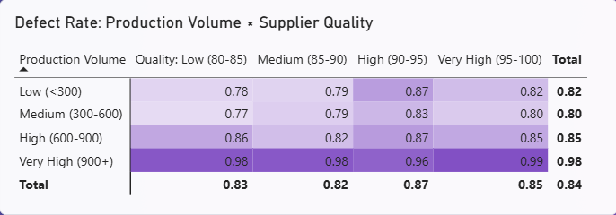

# Manufacturing Quality Analytics

Investigating what drives defect rates in a manufacturing dataset, using Azure SQL, Python, and Power BI — from raw data to a statistically validated business recommendation.

## Dashboard



Dashboard file also available for download: [`powerbi/manufacturing_dashboard.pbix`](./powerbi/Mfg_AB_Testing.pbix) (open in Power BI Desktop, free).

### Key Views
| Maintenance Threshold Effect | Volume × Supplier Quality Interaction |
|---|---|
|  |  |
## The Problem

A manufacturing operation showed an overall defect rate of 84% across production records. This project investigates: **which operational factors most strongly predict defects, and where should quality-improvement effort be focused first?**

## Key Findings

1. **Maintenance hours is the strongest single predictor of defect rate — but the relationship is a threshold effect, not linear.** Defect rate holds steady around 63–75% up to ~10 weekly maintenance hours, then jumps sharply to 94–97% beyond 12 hours. This is statistically significant (two-proportion z-test, p < 0.001, 95% CI 19.8–24.4 percentage points) and was validated as robust at both 2-hour and 1-hour bin resolutions.

2. **Production volume interacts with supplier quality.** At Very High production volume, defect rate stays elevated (96–98%) almost regardless of supplier quality — suggesting volume-driven strain may overwhelm input quality at scale. Supplier quality's protective effect is only clearly visible at Low/Medium production volume.

**Recommendation:** Prioritize investigating equipment crossing the 10–12 hour weekly maintenance threshold, particularly during high-volume production runs — this combination shows the highest observed risk. Maintenance hours should not be treated as a simple linear lever to reduce.

## Tech Stack & Architecture

```
Kaggle CSV → Python (pandas) → Azure SQL Database → Power BI Dashboard
                                        ↑
                              (notebook & SQL queries
                               also read from here)
```

- **Data source:** [Predicting Manufacturing Defects Dataset](https://www.kaggle.com/datasets/rabieelkharoua/predicting-manufacturing-defects-dataset) (Kaggle, synthetic — see [docs/project_notes.md](./docs/project_notes.md) for a full data quality discussion)
- **Cloud database:** Azure SQL Database (free tier, Central India region)
- **Analysis:** Python (pandas, statsmodels, matplotlib) — connects live to Azure SQL
- **Statistical testing:** Two-proportion z-test for A/B-style group comparison
- **Visualization:** Power BI Desktop, connected live to Azure SQL
- **What-if tooling:** Spreadsheet-based sensitivity calculator (maintenance hours → predicted defect rate)

## Repository Structure

```
├── notebooks/
│   └── manufacturing_quality_analysis.ipynb   # Full analysis: EDA → correlation → z-test → threshold effect → matrix
├── sql/
│   └── manufacturing_sql_summaries.sql        # Summary queries run against Azure SQL
├── powerbi/
│   └── manufacturing_dashboard.pbix           # Power BI dashboard file
├── docs/
│   └── project_notes.md                       # Data dictionary + design decisions + data quality notes
├── manufacturing_defect_sample.csv             # Sample of the source data (first ~100 rows)
└── README.md
```

## Methodology Summary

1. **Data quality audit** — screened all 16 predictor variables via correlation against the target before deep-diving into any single one; also validated internal data consistency (see [docs/project_notes.md](./docs/project_notes.md))
2. **Hypothesis testing** — split records into low/high maintenance-hour groups (median split), ran a two-proportion z-test to confirm the observed 22-point defect rate gap was statistically significant, not random noise
3. **Threshold discovery** — binned maintenance hours more granularly to find the relationship is non-linear, then validated this finding was robust across two different bin widths
4. **Interaction analysis** — cross-tabulated production volume and supplier quality to test whether one factor's effect depends on the other, rather than assuming independence
5. **Communication** — built a Power BI dashboard and a spreadsheet what-if calculator so findings are usable by a non-technical stakeholder

Full reasoning behind each methodological choice (why median vs mean, why z-test vs chi-square, why these bin widths) is documented in [docs/project_notes.md](./docs/project_notes.md).

## Notes on Data

This is a synthetic dataset. An internal consistency check found most variables show near-zero correlation with each other, and documented units are inconsistent in time granularity (daily/weekly/monthly fields mixed within rows) — both are disclosed and discussed in [docs/project_notes.md](./docs/project_notes.md), and shaped the decision to keep this analysis strictly cross-sectional rather than treating it as a time series.
